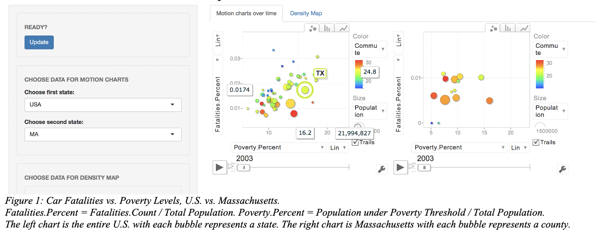
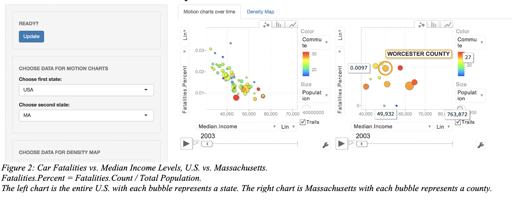
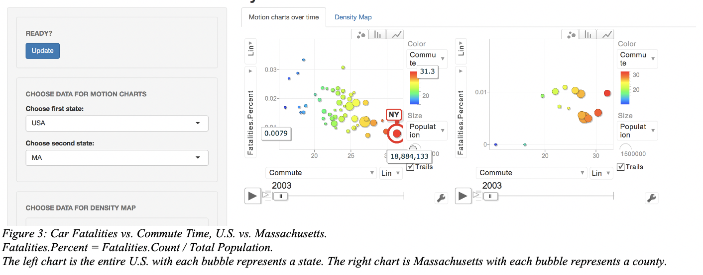
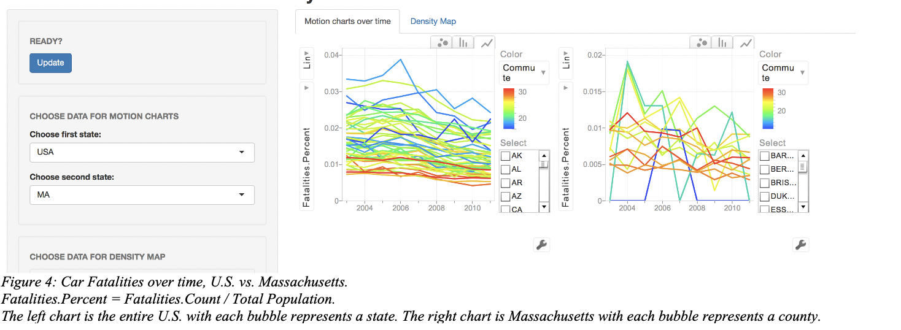
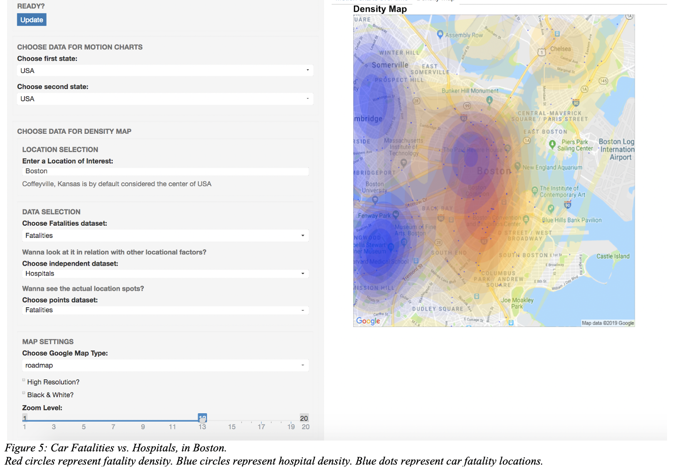
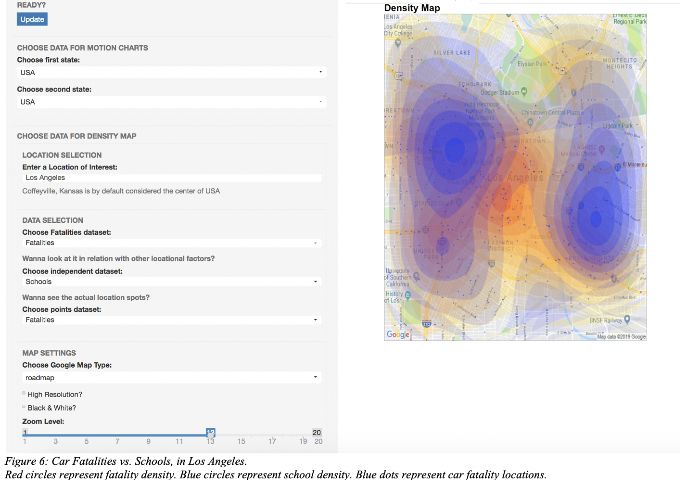

An R project to investigate Car Crash Fatalities in the US using shiny-apps.
<!--truncate-->

## Project Description
A deadly car accident can be an awful thing! So, how do we prevent it from occurring? Well, we can drive very carefully. But is that all? Maybe we can begin to investigate where these deadly car accidents occur most frequently and perhaps gather more information about those high-fatality-rate areas in order to establish better preventative measures. That is precisely what this project aims to do.

You might be wondering who would care about this? The answer is: Lots of people should and we all should too! Such information is extremely useful for many people including:

•	An average person who is a driver and is curious about where car crash fatalities occur and where to be more careful on the road. 

•	Policy makers who want to locate areas with lots of car crash fatalities, so that they can implement preventative policies to make those areas safer.

•	Insurance companies whose profits heavily depend on accurate insurance premium calculations.

•	And many others …

## Data Sources
There are 2 types of data format: count data (aggregated at the state and county level) and geo-coded data (with the exact longitude and latitude of the location). 

Generally, I will use the number of car crash fatalities as my dependent variable for analysis and will look at it in relation to other independent variables. 

Dependent variables: 

•	Number of car crash fatalities by state and county (2003 – 2011):
http://www.nhtsa.gov/FARS. 

Independent variables:

•	Median commute time by state and county (2011):
http://www.indexmundi.com/facts/united-states/quick-facts/all-states/average-commute-time#map 
(Source: American Community Survey)

•	Poverty and income levels by state and county (2003 – 2011):
http://www.census.gov/did/www/saipe/data/statecounty/data/index.html 
(Source: Census Bureau).

•	Geo-coded data of bridges, fuel stations, hospitals, intersections, speed and red-light cameras, malls, and schools across the United States (2011):
http://www.poi-factory.com/poifiles 

## Usage
The program was packaged and uploaded onto https://www.shinyapps.io/ to be accessed [here](https://dtmlinh.shinyapps.io/car-crash-fatalities-exploration-tool/) (Flash needs to be enabled to run properly).

The goal was not only to investigate the factors contributing to the number of car crash fatalities, but also to make such information easily accessible to everyone. Someone might not be interested in reading an academic paper about car crash fatalities with tons of statistical regressions and inferences, but they might be interested in viewing animated charts, graphs, and maps that convey similar information. As a result, this project aims to create an interactive UI that allows people to explore the questions of their own interests. Utilizing the Shiny library in R, 3 simple interactive applications were created for these purposes.

1.	The first application allows you to select a state in the U.S. and observe the number of car crash fatalities, poverty levels, median household income levels, population, and median commute time, as well as their relationships with each other over time (2003 – 2011) via motion charts. 

2. The second application also allows you to select a state in the U.S. and observe the correlations between the average car crash fatalities percent by county and their average distance to the closest school, hospital, bridge, fuel station, mall, speed and red-light camera, historical site, and intersection.

3.	The third application allows you to type in any location in the U.S. of your interest. It then will display a density map that shows the densities of car crash fatalities, schools, hospitals, bridges, fuel stations, malls, speed and red-light cameras, historical sites, and intersections surrounding your location of interest.

## Interest Observations

Depending on the location, different insights and conclusions can be made from this data. 

But, below are some example findings I thought were interesting to me.

- When looking at the motion chart with poverty percentage on the x-axis and fatality percentage on the y-axis (see Figure 1), we can see that there is a positive correlation between the two. So, as poverty percentage increases, fatality percentage also increases. 

- Alternatively, when looking at median household income on the x-axis and fatality percent on the y-axis (see Figure 2), we can see a negative correlation. So, as median household income increases, fatality percentage decreases. This makes sense because as median household income increases, poverty percentage decreases.

- When looking at average commute time on the x-axis and fatality percent on the y-axis (see Figure 3), we can see a negative correlation. So, as average commute time increases, fatality percentage decreases. I thought this was odd at first, but after investigating the data sources, I realized that average commute time data was calculated for all types of transportation, including public transportation. This commute time also includes wait time. So, I theorized that places with higher wait time and use public transportation more often would have longer average commute time. This makes sense because we would think that public transportation is safer; hence, these places would have a lower fatality percentage. 

- Looking at the line chart of fatality percent over time (2003 – 2011) (see Figure 4), we can see that, for the entire U.S., there is a small downward trend over time. We can only speculate why fatality percent is decreasing. It may be that cars are getting safer, roads are getting safer, or people are driving more safely. 

- Figure 5 is a map of Boston and its density of car fatalities and hospitals. It shows that car fatalities concentrate around the Boston Common and the Boston Convention Center areas, while hospitals concentrate around 3 separate areas: Fenway (Harvard Medical School), West End (Mass General Hospital), and Mid Cambridge (CHA Cambridge). According to this map, it looks like car accidents will likely end up being treated at the Mass General Hospital. 

- We can also look at Los Angeles and its density of car fatalities and schools (see Figure 6).

