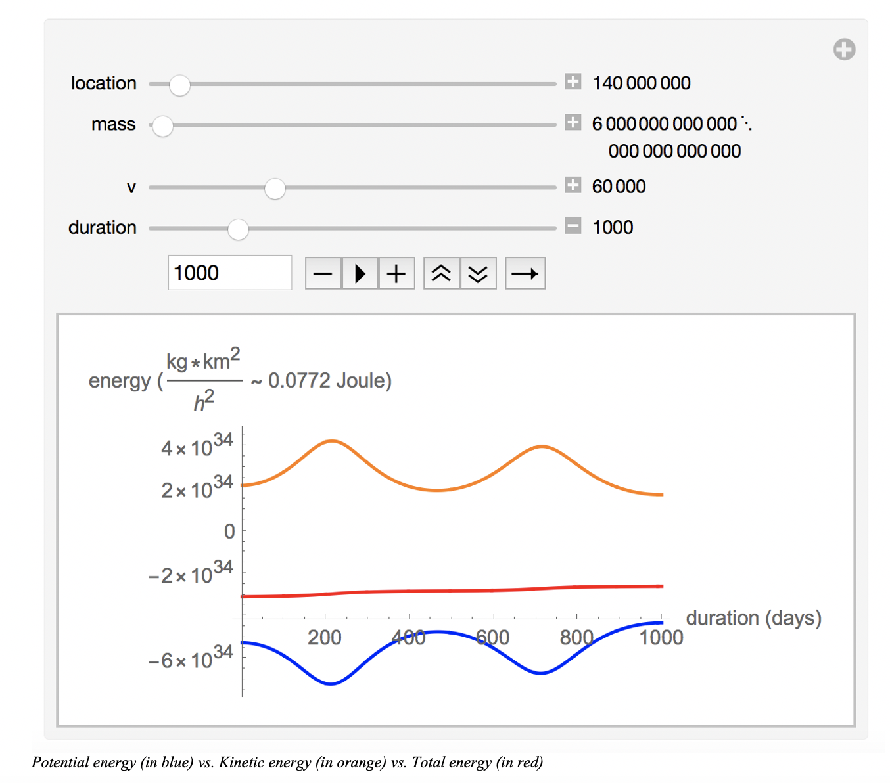
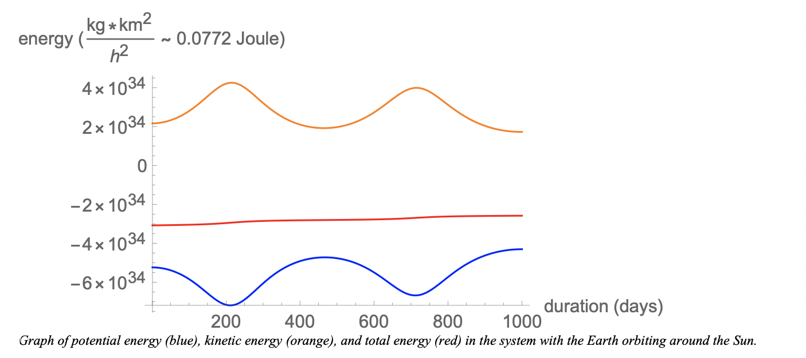
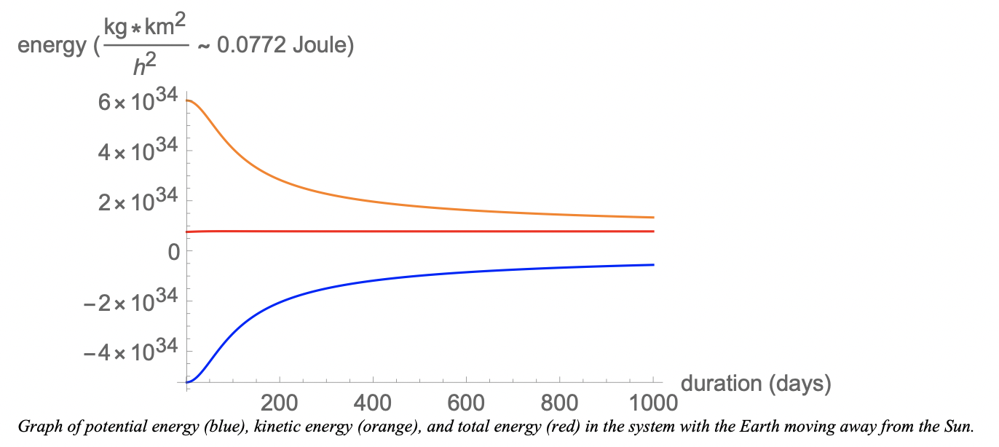
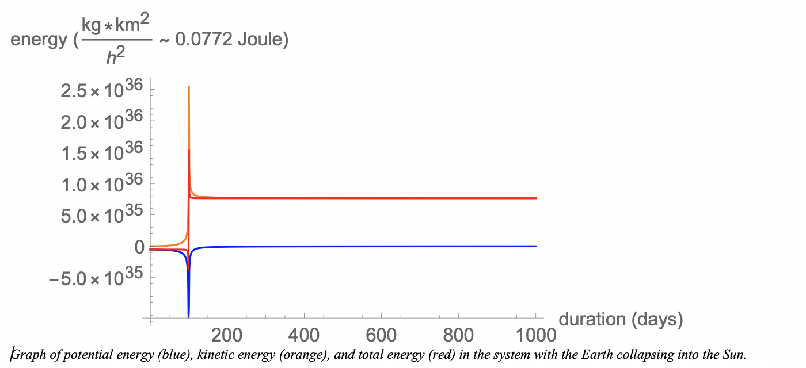

A simulation of a discrete agent-based universe in which each agent reacts to each other according to Newton's law of universal gravitation. 
<!--truncate-->

## Project Description

This Mathematica simulation is an agent-based universe in which each agent reacts to each other according to Newton's law of universal gravitation. Everything is discrete, including time. 

The questions of interest are: 
- How does the initial velocity of one planet affect its trajectory around the sun? How about mass? Location?
- By calculating the gravitational potential (also known as Newtonian potential) energy and the kinetic energy, we will investigate whether the total energy can be conserved in a discrete universe. 

## Theoretical Framework

First, because of the complexity of simulating the entire solar system, only the sun and one planet are included in this model. The sun is set to be initially located at the origin. This origin position (xp, yp), the initial velocities (xv, yv), and the mass of the planet can be manipulated in the model. Each agent will interact with each other according to Newton's law of universal gravitation:

F = G * (m1 * m2) / r2 

where:

F is the force between the masses,

G is the gravitational constant,

m1 is the first mass,

m2 is the second mass, and 

r is the distance between the centers of the masses.

In this equation, r is calculated as √((xp1 - xp2)2 + (yp1 - yp2)2)

After that, we can apply the Newton's law of motion: F = m * a to derive the acceleration vector of each sun. Since we have the initial velocity (vt), we can obtain the velocity (v0) after each unit of time (potentially every second) using the equation vt = v0 + at. The suns will move accordingly to their velocity vectors (xv, yv) and arrive at new positions. Since our universe is discreet, we can only report the positions of all the suns discreetly at each given time.
At each given time and velocity, we can calculate the total energy of each sun using the gravitational potential energy formula and kinetic energy formula: 

U = -m * ∑ [G * (M / r)]

Ek =  1/2 * m * v2

The total energy of the entire universe is then calculated and presented in a graph.

## Usage

By selecting the initial values for: location (distance of the planet from the sun), mass (in this simulation, we will assume the sun and the planet have equal masses), and velocity (initial velocity of the planet), we can look at how the planet would orbit around the sun. 

With the chosen location, mass, velocity, we can calculate and plot gravitational potential energy (in blue), the kinetic energy (in orange), and the total energy (in red) of the system. 

## Observations

- For a given mass and location, there is a certain range of initial velocity for the planet to orbit around the sun. Below that range, the planet will collide with the sun and above that range, the planet will move away from the sun. We can see this by adjusting the initial velocity on the sliding scale. 

- For a given initial velocity and location, the mass of the planet will have an impact on the trajectory of the sun (once the mass of the planet is large enough). For a given mass and initial velocity, the location of the planet with respect to the sun will also have an impact on its own trajectory. We can see this by adjusting the location on the sliding scale.

- We can also see that the potential energy (in blue) and the kinetic energy (in orange) change with time while the total energy seems to be conserved at a constant level.

