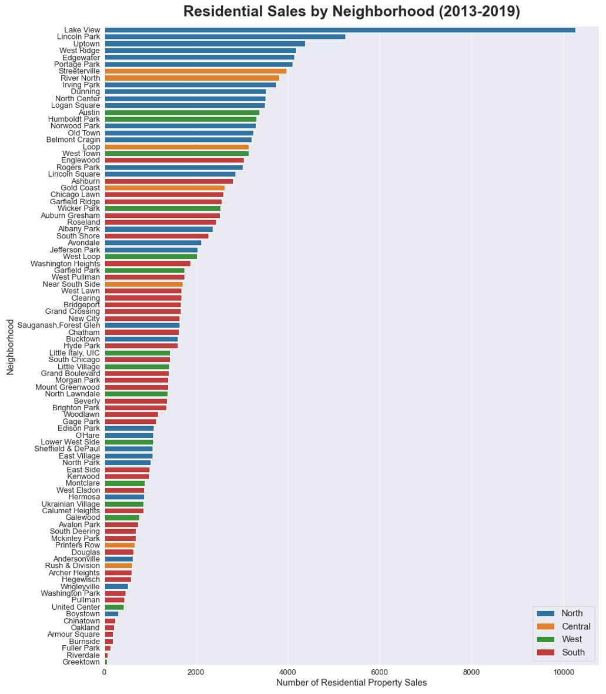
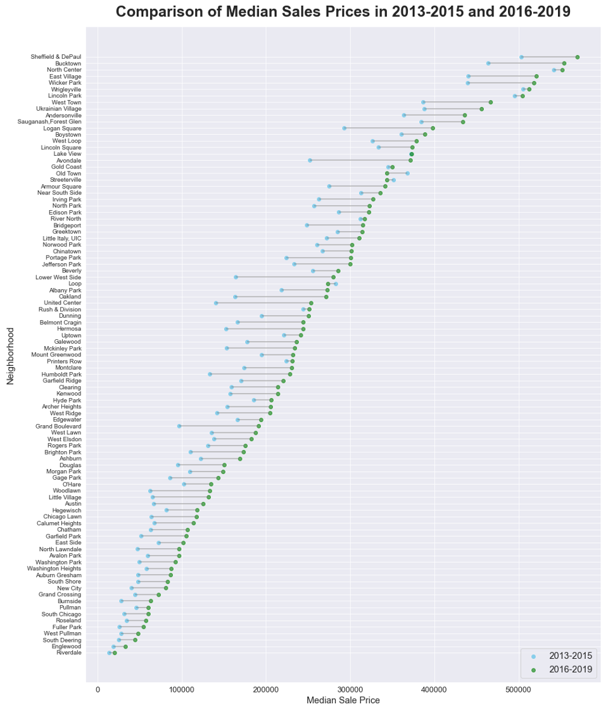
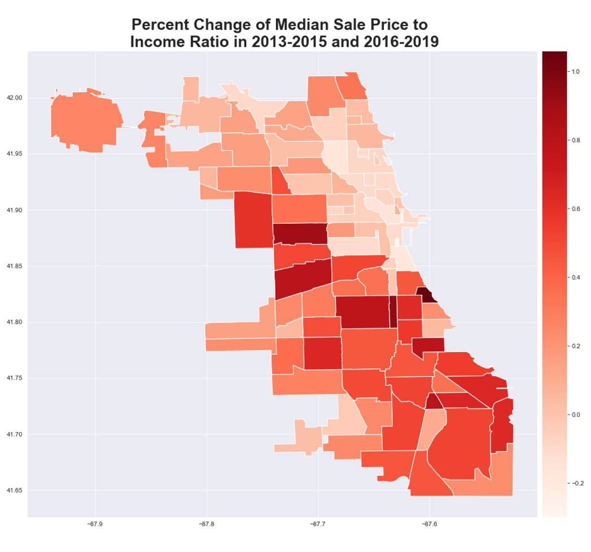
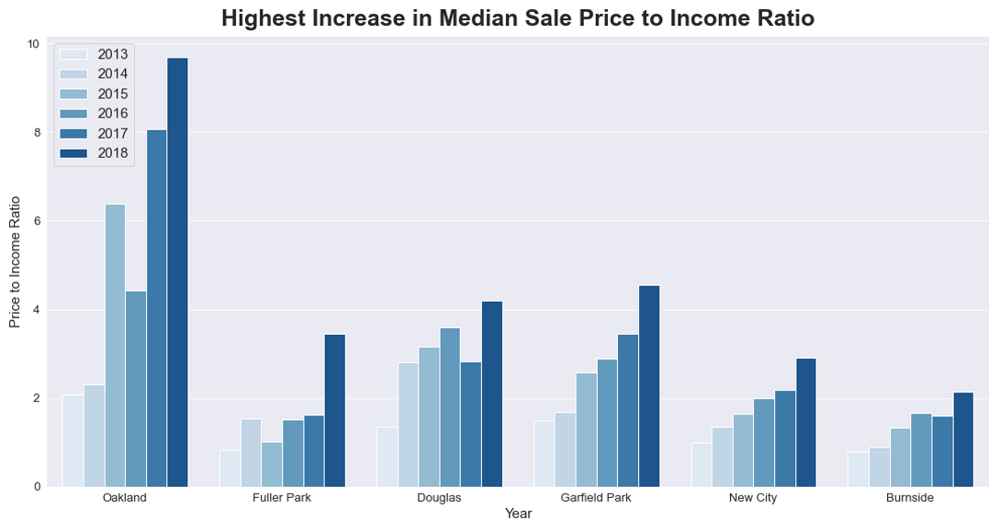
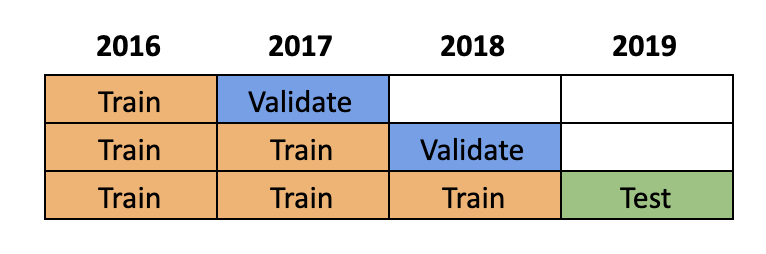
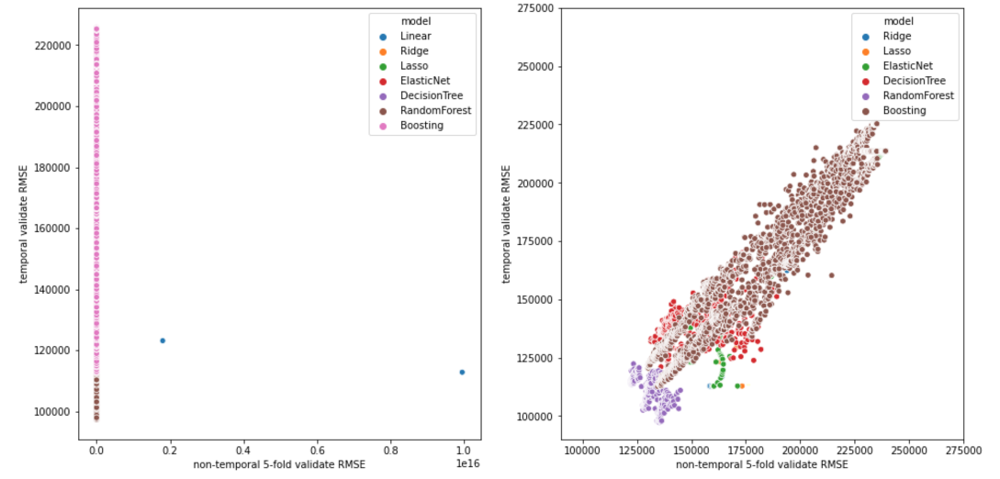
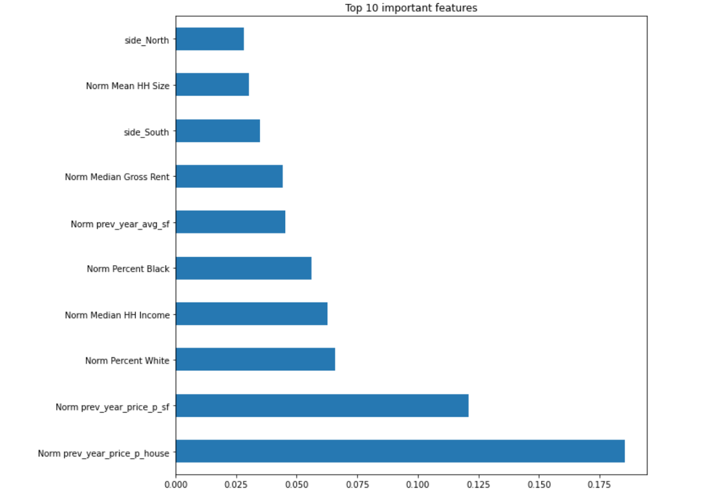
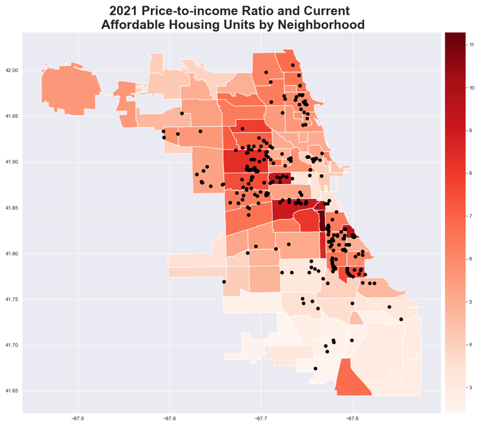

Predicting Chicago housing prices based on neighborhood characteristics.
<!--truncate-->

## Executive Summary
In the past decade, Chicago has been grappling with housing price increases that make it increasingly difficult for lower and middle-class residents to continue affording to live in neighborhoods they have resided in. The rate of property value increase stems from a variety of economic factors that affect neighborhoods differently. We are interested in using those neighborhood characteristics - features such as demographics, crime, and access to public transit - to predict average housing price values in the future. We used regression models to identify neighborhoods where lack of affordable housing is most likely to be an issue. We recommend that policymakers focus affordable housing resources on these areas to ease the burden on lower income residents living in these areas.

## Background
Several economic and environmental factors, such as migration, development, and housing demand, have affected the availability of residential units over the last decade, especially in Chicago. These trends can differ between neighborhoods, with some areas growing quickly while others end up stagnant or falling behind. Overall, Chicago has seen a steady increase in median price of homes sold in the last decade. 

Despite the increased number of single-family housing development in Chicago, there is a growing concern that lower and middle-income families are not able to find suitable housing at a price they can afford. As of 2018, there were about 182,000 more people who need affordable housing than there were low-cost apartment units in Cook County (1). Especially for low-income households withchildren, finding an affordable, right-sized, and safe residential unit can be a challenge.

Institute for Housing Studies published a report showing that the supply of affordable housing has decreased the fastest in areas like Logan Square and other neighborhoods on the city’s North and Northwest sides (2). In response to this report, the city council held a meeting to discuss the development of affordable housing in this area. The city’s immediate response demonstrates the importance of providing affordable housing to the local government.

Growing urban inequality and gap between the demand and supply are accompanying trends to rising housing prices in the United States.  This is an important political issue; in fact, Mayor Lori Lightfoot ran on a platform that emphasized the need to address gentrification and affordable housing challenges.

Knowing the different development trends of neighborhoods in advance can help city officials make policies and allocate resources effectively in order to address the different potential needs and issues within each neighborhood. Policy interventions to increase access to affordable housing can take time. The construction of new affordable housing units (often as a portion of another development project) can take 8-14 months to close (3). Policy changes, including those related to housing subsidies or requirements for developers can take years of debate among city council members. 

Our solution is to use a machine learning model to predict housing prices based on these neighborhood characteristics, several years into the future. With our model to predict housing prices several years into the future, city leaders will be better able to proactively allocate resources and plan for future housing shortages, rather than reacting to housing price increases after it has already occurred.

## Methodology
### Data
A Census block is the smallest geographic area for which the Bureau collects and tabulates data (4). Our data was aggregated on the Census block group level (BG), which is the next level above and a combination of census blocks in the geographic hierarchy. 

The datasets were retrieved from three main sources: Cook County Assessor's Office, City of Chicago Data Portal, and United States Census Bureau. Each row initially represented an individual sale of a property from 2013 to end of 2019, with characteristics of the census block group for each property. This dataset was then aggregated by the Census block group level by taking the average sales price for each census block group for each year to use as a row in our dataset. This allows for more granularity in our analysis, though our conclusions and data visualizations are aggregated at the neighborhood level. 

Policy recommendations are also most suitable at the neighborhood level, as neighborhoods have differing characteristics and trends that can be targeted through policy interventions (5).

First, we examine the home sales transactions by aggregating the number of property sales by each neighborhood. Figure 1 demonstrates that Lake View had by far the highest level of transaction activity in the last decade, with the number of property sales being  twice that of the  next-most neighborhood (Lincoln Park). 15 of the 17 neighborhoods with the highest number of residential property sales were in North or Central Chicago, indicating a higher concentration of apartments and an increased development since 2013. 

*Figure 1: Number of property sales by neighborhood*

-Note: figure depicts the number of residential property sales by neighborhood, which was calculated by summing the number of sales in the Census block that is within a neighborhood area.-

Figure 2 depicts how the home sales price has shifted between 2013-2015 and 2016-2019 per neighborhood. Almost every neighborhood in Chicago saw an increase in median sales prices in the last decade, with areas like Lower West Side and Avondale seeing the highest increase in dollar value. While it is true that affluent neighborhoods in North and Northwest Chicago have seen increases in median sales prices, incomes have risen faster for more affluent residents in these neighborhoods. Income growth rate at the high end - marked with constrained residential units and higher housing competition - has more closely tracked changing home prices, which have made them still affordable despite the increase in prices. 

*Figure 2: Median sales price change per neighborhood*

-Note: Figure depicts the change in average median prices from 2013-2015 to 2016-2019. The median price was averaged across multiple years (2013-2015 and 2016-2019) and percent change was calculated by comparing these two average prices.-

Meanwhile, areas in west and south Chicago saw the highest percent increase in median sales price, with areas like Grand Boulevard and Woodlawn seeing their sales prices increase by almost two-fold. In fact, according to Figure 3, neighborhoods that saw the highest increases in price-to-income ratios (often a measurement of housing  affordability) were in west and South Chicago. The rise in home prices relative to incomes has fueled concerns about housing affordability, especially in low to middle-income neighborhoods.

*Figure 3: Percent change in sale price to income ratio*

-Note: Ratio for a particular year was calculated by dividing the neighborhood’s median sale price to median income. This ratio was averaged across multiple years (2013-2015 and 2016-2019) and percent change was calculated by comparing these two ratios-

Large increases in price-to-income ratios in these neighborhoods are due to rapid growth in home prices, relatively stagnant incomes, and low interest rates that lower the cost of mortgage, allowing buyers to bid up prices. Figure 4 shows the neighborhoods with the highest increase in price-to-income ratios in a five year period. Areas like Oakland and Fuller Park, located in South Chicago, have also been experiencing large decreases in Black population in the last several decades. 

*Figure 4: Change in price-to-income ratio*

-Note: figure shows the neighborhoods with the largest change in price-to-income ratio from 2013 to 2018.-

## Machine Learning Model
### a) Problem Formulation and Features Selection
To address the policy issues raised in the Executive Summary, we want to be able to predict the average house price per Census block group a few years into the future. We ended up choosing this time lag to be 3 years for the following reasons:

+ Some of our features (i.e., Census data) are usually available with at least 1 year lag to the current year (i.e., the latest Census data in 2020 is Census 2018).
+ It takes time to implement any policy changes so ideally we would want to predict house price changes at least 2 years into the future. 

We have identified that our prediction problem is a regression machine learning problem. We used linear regression techniques and conducted a grid search using the following models: Linear Regression, Ridge, Lasso, Elastic Net, Decision Tree Regressor, Random Forest Regressor, and Gradient Boosting Regressor. We chose these models because they are suitable to predict quantitative outcomes with high levels of accuracy (measured by Root Mean Squared Error throughout our analyses). 

As described above, our target variable is the average house price per Census block group. When aggregated at the census block group, we had approximately 10,000 data points per year. And our features set include the following variables:

+ Demographic data (6): Total Population, Median Age, Median Household Income, Total Housing Units, Median Number of Rooms, Median Year Built, Median Gross Rent, Mean Household Size, Percent White Population, Percent Black Population, Percent Household with Children, and Percent Housing Vacant. All demographic data is retrieved from ACS for the Census block group level and is 3 years lagged (i.e., features data is 3 years before target data).
+ Crime data (7): Total Number of Crimes (all types of crime) and Total Number of Crimes per Capita (Total Number of Crimes / Total Population from ACS). All crime data is calculated for the Census block group level from the original data set and is 3 years lagged (i.e., features data is 3 years before target data).
+ Transportation data (8): Distance to the nearest L train station (distance is calculated in miles). All distance data is calculated for the Census block group level from the original data set. This feature data is not lagged.
+ Public Schools data (9): Number of Public Schools. All public schools data is calculated for the Census block group level from the original data set and is 3 years lagged (i.e., features data is 3 years before target data).
+ Sales & housing attributes data (10): Number of Sales, Average Age of House Sold, Price per Square Feet, Price per House, and Average Square Feet of House Sold. All sales & housing attributes data is calculated for the Census block group level from the original data set and is 3 years lagged (i.e., features data is 3 years before target data). There were approximately 220K housing sales data points, after we filtered the original 583K sales in Cook County by the sales that occurred within the City of Chicago.
+ Neighborhood and Side indicators (11): Dummy variables indicating which neighborhood (i.e., Hyde Park, Woodland, etc.) and which side (i.e., North, West, etc.) the Census block is in. This feature data is not lagged.

During the process that we analyzed the correlations and distributions of all our features data, no clear insights about additional feature transformations came up. Therefore, we did not engineer any new features other than the ones listed above.

### b) Temporal Train, Validate, Test Sets 
Because we want to use past features data (i.e., 3 years lagged) to predict the future average house price per Census block group, we need to split our train, validate, and test sets temporally, as follow:

The years noted above (i.e., 2016, 2017, 2018, 2019) indicate the years of the target variable and *-not-* the years of the features data (e.g., “2016 Train” means the training set for 2016, which includes the average house price per Census block group for 2016 and the features data (e.g., Census, Crime, Sales & Housing Attributes, etc.) from 2013). 

Because the oldest data we have for *-all-* the features is from 2013 (e.g., Cook County Assessor’s Residential Sales Data is only available from 2013), the earliest year we can train our model on predicting is 2016 as seen above. Because of this limitation, we only have 2 validate sets and 1 test set as seen above. As a result, we will also look at some non-temporal 5-fold cross validate results to corroborate that our final model is not too overfitting. For non-temporal 5-fold cross validation, we will split each train set (1 train set is before 2017, and 1 train set is before 2018) into 5 folds randomly and report the average test error (measured as RMSE of the validate fold) where appropriate.

### c) Models and Hyper Parameters Grid Search
We first tried a simple Linear Regression (this model has no hyper parameters to tune) and then tried different sets of hyper parameters for each of the following models: Ridge, Lasso, Elastic Net, Decision Tree Regressor, Random Forest Regressor, and Gradient Boosting Regressor. Please see our Git repository “train-models-final” notebook for more information on which hyper parameters were included in our grid search. 

#### d) Evaluation and Results
We used Root Mean Squared Error as our evaluation metric for accuracy because our machine learning problem is a regression problem and MSE is a common evaluation metric for this type of problem. We used RMSE instead of MSE because it is easier to interpret. As mentioned above, because we only have 2 temporal validate sets (which we were concerned as too few validate sets), we would try to look at both the temporal validate RMSEs and the non-temporal 5-fold validate RMSEs where appropriate. 

As you can see from the chart above, a simple Linear Regression model is just really bad (the left chart), and the best model class (based on RMSE) appears to be the Random Forest Regressor, which we ended up choosing to be our final model class. 

Based on our grid search results of the hyper parameters tuning process for the Random Forest Regressor, the table below shows the top 3 sets of hyper parameters based on their temporal validate RMSEs of 2017 and 2018 (we took the average of 2017 rank and 2018 rank and showed the top 3 based on this average rank):

|                                         Params                                         |  Non-temporal 5-fold validate RMSE (data = Before 2017)  |  Non-temporal 5-fold validate RMSE (data = Before 2018)  |  Temporal validate RMSE (data = 2017)  |  Temporal validate RMSE (data = 2018)  | 2017 rank | 2018 rank | Avg rank |  Temporal test RMSE (data = 2019) | 2019 rank |
|:--------------------------------------------------------------------------------------:|---------------------------------------------------------:|---------------------------------------------------------:|---------------------------------------:|---------------------------------------:|----------:|----------:|---------:|----------------------------------:|----------:|
| {'max_depth': 70, 'max_features': 'sqrt', 'min_samples_split': 2, 'n_estimators': 500} |                                                  	134,749 |                                                  	129,738 |                                 	97,553 |                                	108,888 |         3 |         2 |      2.5 |                            90,355 |         6 |
| {'max_depth': 90, 'max_features': 'sqrt', 'min_samples_split': 2, 'n_estimators': 500} |                                                  	135,183 |                                                  	130,179 |                                 	97,286 |                                	109,222 |         2 |         7 |      4.5 |                            90,070 |         4 |
| {'max_depth': 40, 'max_features': 'sqrt', 'min_samples_split': 2, 'n_estimators': 500} |                                                  	134,658 |                                                  	130,077 |                                 	97,758 |                                	109,073 |         5 |         6 |      5.5 |                            89,959 |         3 |

It is worth noting that the non-temporal 5-fold validate RMSEs of these 3 sets of hyper parameters are within +6% of the “best” non-temporal 5-fold validate RMSE we got in both 2 train sets (before 2017 set and before 2018 set), which gave us confidence to choose these as our final candidates. You can also see from the above that our RMSEs of the temporal test set (2019 data) is smaller than that of the temporal validate sets for these 3 sets of hyper parameters. Additionally, all of them ranked pretty high (top 10) by temporal test set RMSEs, which further corroborates our choice of the final model (Random Forest Regressor) and hyper parameters. Because we were still a little bit concern about overfitting, we decided to go with the “least complicated” set of hyper parameters:

{'max_depth': 40, 'max_features': 'sqrt', 'min_samples_split': 2, 'n_estimators': 500}

Lastly, we did look at model performances by hyper parameter groups and did not see anything too abnormal (see Appendix I for more details). 

### e) Predictions into the Future
As a result, we decided to proceed with the above “least complicated” set of hyper parameters. That means, we used this set of hyper parameters to retrain the Random Forest Regressor using all data from both the train, validate, and test sets (i.e., from 2016 to 2019) to derive a final Random Forest Regressor, which we then used to predict the average house price per Census block group for 2020 and 2021 (where we do not have labeled data for). Because 2020 is already halfway through, our conclusions and policy recommendations will focus on the predictions for 2021 instead of 2020. 

See Figure 5 for the top 10 important features of this final Random Forest Regressor. 

*Figure 5: Features Importance of the Final Random Forest Regressor*

## Conclusion
### Policy Recommendations
Our model can help us make policy recommendations to city officials about where affordable housing might be a more pressing  issue in the future. Our model predicted that the neighborhoods depicted in the table below may experience the highest increase in housing price relative to income: 

*Table 1: Neighborhoods with highest predicted price-to-income ratio*

|   Neighborhood  |  Side | 2021 Predicted Median Sale Price | Median Income | Price-to-income Ratio |
|:---------------:|:-----:|:--------------------------------:|:-------------:|:---------------------:|
|  Armour Square  | South |            $387,554.01           |    $34,303    |         11.30         |
|    Chinatown    | South |            $410,604.37           |    $42,386    |          9.69         |
|     Oakland     | South |            $290,000.73           |    $30,469    |          9.52         |
|  United Center  |  West |            $423,233.00           |    $45,771    |          9.25         |
| Lower West Side |  West |            $387,448.39           |    $43,006    |          9.01         |
|   Fuller Park   | South |            $206,206.69           |    $24,011    |          8.59         |
|  Humboldt Park  |  West |            $346,761.09           |    $41,500    |          8.36         |
|    Bridgeport   | South |            $375,172.91           |    $46,397    |          8.09         |
|     Avondale    | North |            $471,878.33           |    $59,745    |          7.90         |
|     Woodlawn    | South |            $227,180.64           |    $29,970    |          7.58         |

In addition, as shown in Figure 6, we wanted to compare these neighborhoods with the location  of currently available affordable housing resources available. Some examples of policy interventions include increased access to voucher-based subsidies, new construction of affordable units, and modifications to affordable housing requirements for new developers. Our policy recommendations will focus on interventions in specific neighborhoods - so, mainly the development of affordable housing units.

*Figure 6: Sales price-to-income ratio and number of affordable housing units*

There are several different ways Chicago approaches the development of affordable housing units. One approach is through the Affordable Requirements Ordinance (ARO), which requires developers seeking a zoning change or financial assistance from the city to allocate 10 percent of their property as affordable housing units. Revisions of the ARO are currently being discussed in City Hall, so our recommendations will come at a relevant time to advise policymakers’ decisions.

Our recommendation is to increase the affordable housing requirement to 15 to 30 percent in neighborhoods we predict to have larger increases in housing price relative to income, while maintaining the 10 percent requirement in lower growth neighborhoods. This recommendation builds off a pilot program in the Near North Side, Near West Side, and Milwaukee Avenue corridors where this requirement has been increased to 15 or 20 percent starting in 2017. Our model provides greater specificity on which neighborhoods to focus on compared to the existing pilot program, and emphasizes a slightly different set of neighborhoods (our list of neighborhoods is more concentrated in South Chicago). The updated requirement would aim to increase the availability of affordable housing in neighborhoods experiencing high housing price growth.

Additionally, under the current version of the ARO, developers are allowed to pay a one-time fee in lieu of building in affordable housing units. We recommend that the city adjust the required percentage of affordable units based on the affordability of the neighborhood. We recommend that the city revisit the fee requirements by either increasing the fee in the neighborhoods with most rapidly rising housing prices, or disallowing the fees altogether. 

### Ethical Concerns
One ethical concern can be how this data is used. According to Rachel Weber (University of Illinois-Chicago) predictions could potentially become self-fulfilling prophecies. If such a model was published by a reputable source, real estate investors may use these models to determine where to purchase property or develop new apartment complexes, since these groups would like to see housing prices increase as it would maximize their own profit.

### Limitations, Caveats, and Future Suggestions

It is difficult to have a perfect measure to capture how the affordability of an area may change over time. We used housing sales prices to capture these trends, but there are limitations to using this metric. One issue is the relative lack of data points available for housing sales. Only a small proportion of houses are sold in any given year. Since our target variable is the average housing sales price aggregated at the census block level, the lack of data could potentially skew our target variables. 

Using housing sales specifically also doesn’t capture the trends in rental rates, which represented about 43% of households in 2017. Renters can be a significant portion of the households in a given locale, and the proportion of renters is also an underlying characteristic that can introduce bias in our target variable. For example, housing sales may be more prevalent in areas where homeownership is high, thus providing a more robust dataset for these areas. The areas with more homeowners might have different characteristics than areas with more renters. By only using home sales as our target variable, we could be using a slightly biased target variable.

In the future, we hope to expand upon our target variables by including more data on renters and home assessments outside of sales. We could also look into property development, particularly of new apartment complexes, trends in a given area. Unfortunately, these metrics currently are imperfect. Rental rates differ significantly based on their characteristics (e.g. number of rooms in house, square footage) and it is difficult to extract these characteristics from renters data. Housing price assessments for homes that have not been sold often rely on algorithms to determine price, which doesn’t give us a ‘real’ metric to use as a target.
