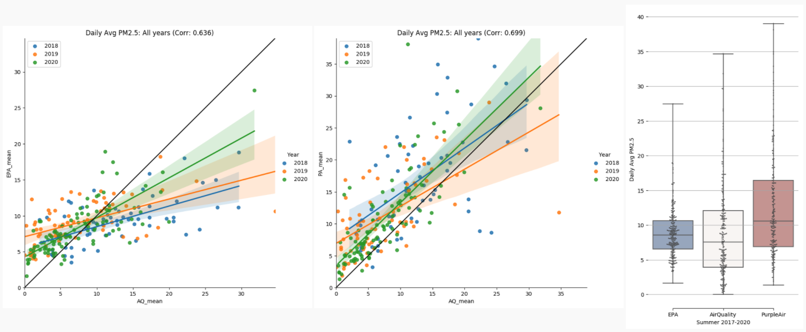
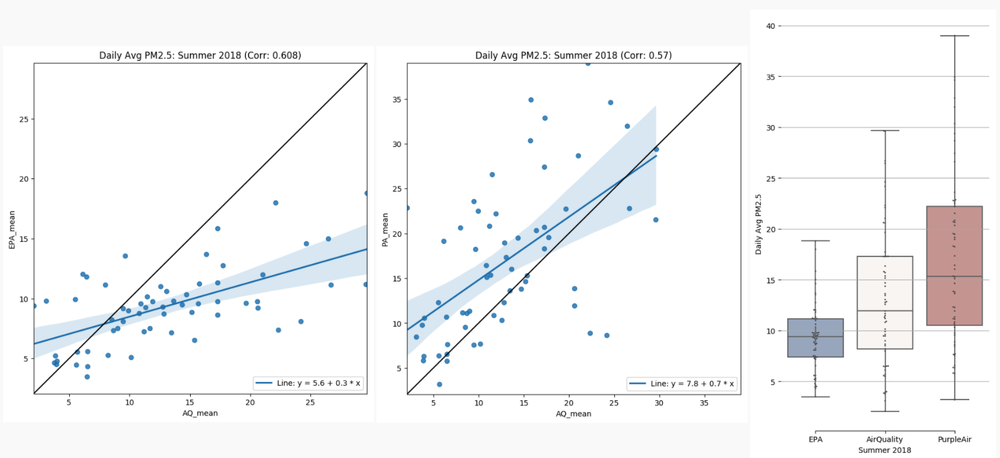
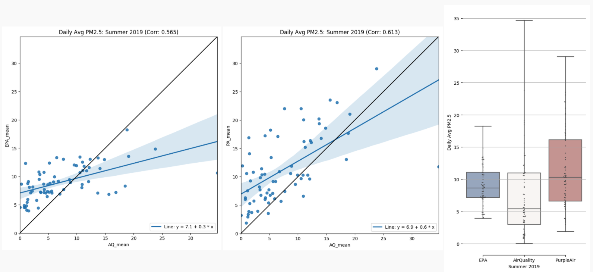
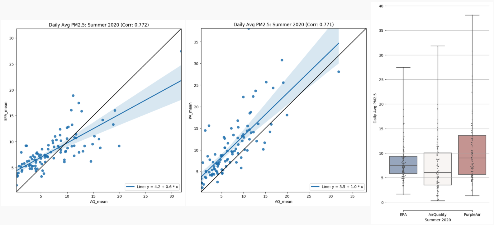

## Overview
This [prototype tool](https://chicago-air-quality.herokuapp.com/) helps compare 3 different PM 2.5 data sources, by day and neighborhood, in Chicago:
- ELPC community monitoring [data](https://airqualitychicago.org/) (AirQuality data hereafter)
- Environmental Protection Agency public air sample [data](https://aqs.epa.gov/aqsweb/documents/data_api.html) (EPA data hereafter)
- Purple Air self-reported [data](https://www2.purpleair.com/) (PurpleAir data hereafter)

## Goals
This tool aims to:
- illustrate the trends of PM 2.5 measurements in the Chicago area for 4 summers: 2017, 2018, 2019, 2020
- identify days where the discrepancies (in terms of PM 2.5) between AirQuality and EPA and/or PurpleAir data are significant and locate the neighborhoods where these discrepancies might be coming from
- provide a more detailed view into specific neighborhoods, more specifically:
  + locate blocks with much higher average PM 2.5 levels
  + identify hours with much higher average PM 2.5 levels

## Preliminary Analysis Results

1. Averages and Coverages
Looking at AirQuality data from all 4 summers (2017-2020):
- 5 neighborhoods with the highest average PM 2.5 are: Andersonville, Greektown, Ukrainian Village, Calumet Heights, and Portage Park.
- 5 neighborhoods with the most number of days coverage are: Loop, Lincoln Park, Hyde Park, West Loop, and Little Italy, UIC. 

2. ELPC data vs. EPA data vs. Purple Air data

Looking at data from 3 summers (2018-2020), the overall averages between the 3 data sources are quite in line. 
- PurpleAir data tends to have a slighlty wider range and a slight higher average than both AirQuality and EPA data. 
- EPA data tends to have the narrowest range compared to AirQuality and PurpleAir data. 
- EPA data is also the most consistent year over year wheareas AirQuality data varies quite a lot year over year (likely due to the differences in coverage year over year).

Note: PurpleAir data was not avaible before Sep 2017 (there were no publicly available sensors installed before Sep 2017); hence, comparison for 2017 is not available.

Summer 2018: 

Summer 2019:

Summer 2020: 

