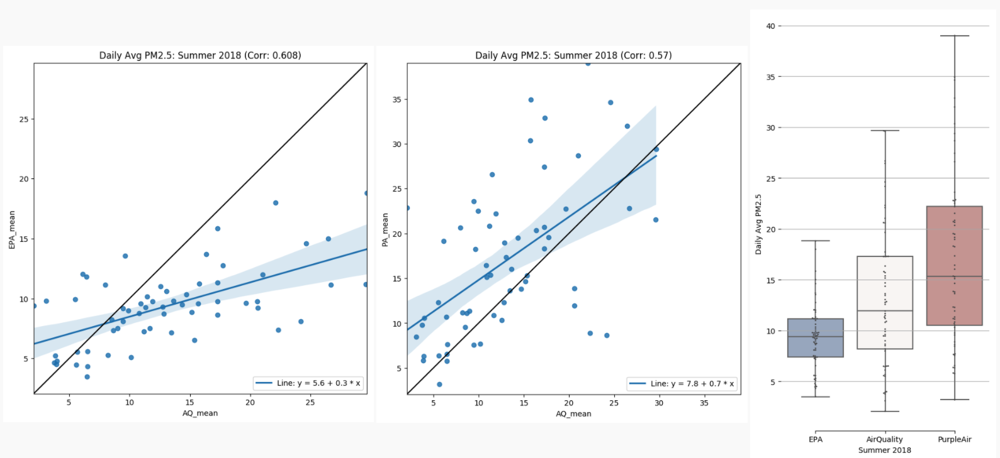
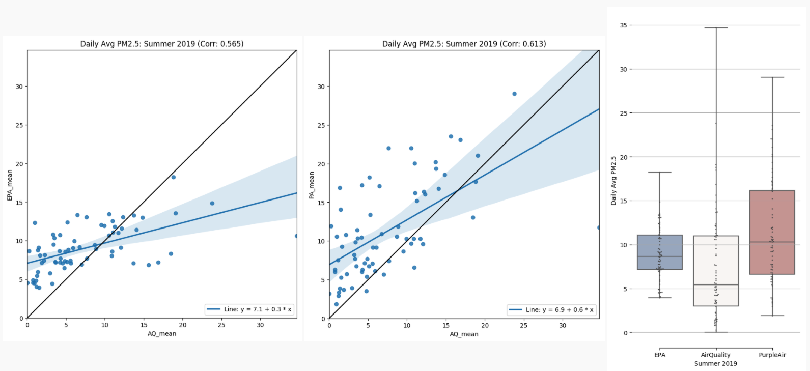

This [prototype tool](https://chicago-air-quality.herokuapp.com/) illustrates and compares 3 different PM 2.5 data sources, by day and neighborhood, in Chicago.

<!--truncate-->

## Overview
This [prototype tool](https://chicago-air-quality.herokuapp.com/) ([Source code](https://github.com/dtmlinh/Air-Quality-Tool)) illustrates and compares 3 different PM 2.5 data sources, by day and neighborhood, in Chicago:
- ELPC community monitoring [data](https://airqualitychicago.org/) (AirQuality data hereafter)
- Environmental Protection Agency public air sample [data](https://aqs.epa.gov/aqsweb/documents/data_api.html) (EPA data hereafter)
- Purple Air self-reported [data](https://www2.purpleair.com/) (PurpleAir data hereafter)

## Goals
This tool aims to:
- illustrate the trends of PM 2.5 measurements in the Chicago area for 4 summers: 2017, 2018, 2019, 2020
- identify days where the discrepancies (in terms of PM 2.5 levels) between AirQuality, EPA, and PurpleAir data are significant and locate the neighborhoods where these discrepancies might be coming from
- provide a more detailed view into specific neighborhoods, more specifically:
  + locate blocks with much higher average PM 2.5 levels
  + identify hours/time periods with much higher average PM 2.5 levels

## Preliminary Analysis Results

### 1. Overall averages and coverages
Looking at AirQuality data from 4 summers (2017-2020):
- 5 neighborhoods with the highest average PM 2.5 levels are: Andersonville, Greektown, Ukrainian Village, Calumet Heights, and Portage Park.
- 5 neighborhoods with the most number of days coverage are: Loop, Lincoln Park, Hyde Park, West Loop, and Little Italy, UIC. 

### 2. AirQuality data vs. EPA data vs. PurpleAir data

Looking at data from 3 summers (2018-2020), the overall averages between the 3 data sources are quite in line. 
- PurpleAir data tends to have a slighlty wider range and a slight higher average than both AirQuality and EPA data.
- EPA data tends to have the narrowest range compared to AirQuality and PurpleAir data. 
- EPA data is also the most consistent year over year wheareas AirQuality data varies quite a lot year over year (likely due to the differences in coverage year over year). PurpleAir data seems more consistent (than AirQuality data) year over year as well, although not as much as EPA data. 

*Note:* PurpleAir data was not avaible before 09/2017 (there were no publicly available sensors installed before 09/2017); hence, comparison for summer 2017 is not available.

- Summer 2018: EPA (8-12) < AirQuality (8-17) < PurpleAir (11-22)

- Summer 2019: AirQuality (3-11) < EPA (7-11) < PurpleAir (7-16)

- Summer 2020: AirQuality (4-10) < EPA (6-9) < PurpleAir (6-14)

These observations do not really change if we apply further geographical restrictions, more specifically:
- only using AirQuality measurements within a 2-mile radius of an EPA or a PurpleAir sensor for comparison

We can also look at a heatmap for Summer 2020 to identify certain days where the discrepancies are higher between data sources for additional analyses:

For example, we can see that, on 2020/06/22, the readings from AirQuality and PurpleAir are twice as high as the readings from EPA. We can then drill down to look at where the measurements (of all 3 sources) come from for this date.

For this particular date, it looks like the measurements were higher in some parts of Evanston and Lincoln Square (where AirQuality measured) and in some parts of McKinley Park and Brighton Park (where PurpleAir measured). But EPA sensors are located quite far away from these spots; hence, the there are discrepancies between different sources.

*Caveats:* Because the data is quite sparse/spreadout geographically when looked at on a daily basis, this type of comparison could be a bit unreliable and inconclusive. However, it's worth noting that, generally, we do see that the data is pretty consistent across sources, even when looked at on a daily basis and mapped out across Chicago. 

### 3. Neighborhood-Specific observations (only using AirQuality data because it is the only source with wider geographical coverage)

After looking at Chicago overall, we also want to drill down to some specific neighborhoods to see if 
there are any interesting patterns or trends at the neighborhood level.

Let's look at Hyde Park an example (because we have quite consistent data from Hyde Park). 

The first set of figures summarizes the trends of average PM 2.5 levels in Hyde Park by year and by month respectively. We can see that Hyde Park's monthly average PM2.5 levels are between 5 and 15. Year 2018 has a slightly higher average than other years. We also seem to have more data for summer 2018 and summer 2020 than summer 2017 and summer 2019

 

The second set of figures (i.e., maps) flags the Census blocks within Hyde Park that fall into the top 10th percentile (in terms of average PM2.5 levels) in a given year and month respectively. Below are the yearly maps for Hyde Park:

- Hyde Park 2017:

 

- Hyde Park 2018:

 

- Hyde Park 2019:

 

- Hyde Park 2020:

 

Based on the above figures, it looks like there are no blocks that were consistently suffering from higher PM2.5 levels (than the rest of Hyde Park) between 2017-2020.

*Caveats:* AirQuality data is measured via mobile devices by volunteers; hence, the locations and the time intervals of the measurements are not fixed year over year. Hence, the variations we saw above could come primarily from this set up. 

Lastly, the last set of maps flags any spots that we have AirQuality data for that reach harmful PM2.5 levels. The maps are set up so we can look at the harmful PM2.5 levels by month of year and by hour of day. For example, I often run around the Midway Plaisance and it looks I should not be running there at noon or around 6pm. The best time, it looks like is either early morning or around 4-5pm. 

At noon:

 

At 6pm:

At 7am:

 

At 5pm:

