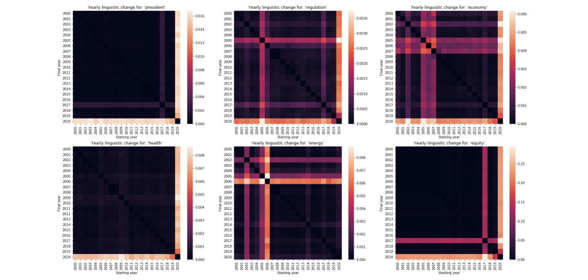
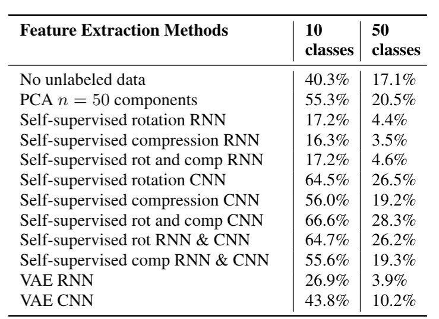
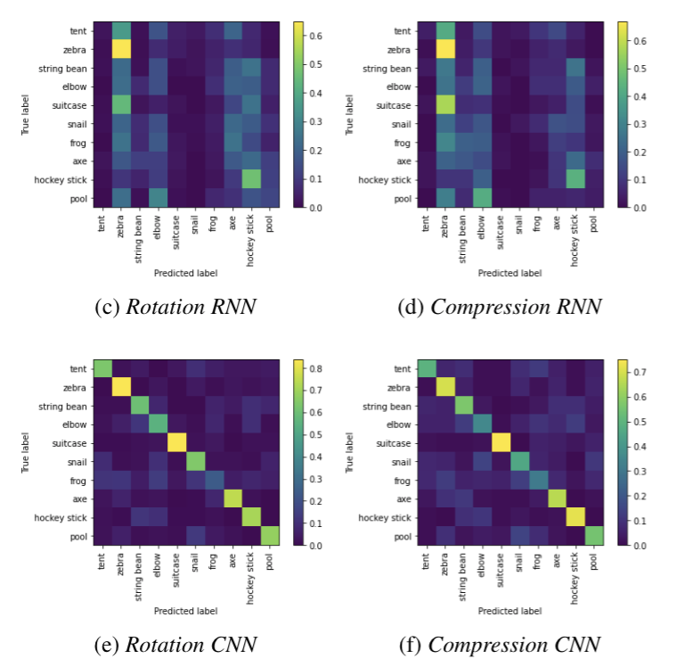

## [Chicago PM2.5 Levels Comparison](https://github.com/dtmlinh/Air-Quality-Tool)

   A prototype tool which illustrates and compares 3 different PM 2.5 data sources, by day and neighborhood, in Chicago: ELPC community monitoring ([data](https://airqualitychicago.org/)), Environmental Protection Agency public air sample ([data](https://aqs.epa.gov/aqsweb/documents/data_api.html)), Purple Air self-reported ([data](https://www2.purpleair.com/)). Frameworks/tools/packages used: `Django`, Webscraping (`Selenium`), API Requests, `Plotly`, `Heroku`.
   
   This tool aims to: \
    - illustrate the trends of PM 2.5 measurements in the Chicago area for 4 summers: 2017, 2018, 2019, 2020 \
    - identify days where the discrepancies (in terms of PM 2.5 levels) between AirQuality, EPA, and PurpleAir data are significant and locate the neighborhoods where these discrepancies might be coming from \
    - provide a more detailed view into specific neighborhoods, more specifically: \
      + locate blocks with much higher average PM 2.5 levels \
      + identify hours/time periods with much higher average PM 2.5 levels 
   
   *Access the tool [here](https://chicago-air-quality.herokuapp.com/). And more detailed analysis results can be found [here](https://dtmlinh.github.io/Linh.Dinh/blog/2020/11/02/blog-post).* \
   
   
   
## [Predicting housing prices in Chicago](https://github.com/ymericson/ml-project) 
   *__with Eric Son, Emily Zhang__*
   
   A machine learning model that predicts housing prices for 2021 (2 years ahead the latest available data) in Chicago, IL using neighborhood characteristics. 
   
   Our housing price data uses housing sales in 2013 - 2019 from the Cook County Assessor's Office, aggregated at the Census block group level. Our features include data on demographics, crime, distance to public transit, and more. The purpose of our model is to predict housing price trends in neighborhoods across Chicago, in order to help the city government better predict the areas where housing prices is expected to rise. More advance notice on housing price trends can help the city assess areas where affordability is expected to be more of an issue, so that they can focus resources for affordable housing. Different sets of hyper parameters for each of the following models were tuned and evaluated: Simple Linear Regression, Ridge, Lasso, Elastic Net, Decision Tree Regressor, Random Forest Regressor, and Gradient Boosting Regressor.
   
   *Access the full report [here](https://dtmlinh.github.io/Linh.Dinh/blog/2020/06/15/blog-post).* \
   
   
    
## [Fatality rates of U.S. traffic accidents](https://github.com/dtmlinh/Traffic-Fatalities-HDFS)

   A project to look at the fatality rates of traffic accidents in the US and which factors might impact these rates. This project utitlizes several big data tools: AWS EMR cluster, `HDFS`, `Hive`, `Spark`, `Hbase`, etc. 
   
   The final output shows by State and Year:
   - the fatality rate for serveral interesting conditions that might influence whether an accident is fatal or not: day vs. night time, at a junction, weather, etc.
   - average number of minutes injured persons arrive at the hospital 
   - average number of hospitals within a 10 mile radius of the accident 
   - share of state spending on highway investments and health investments 
   
   
   
   *Additionally, here's a related [Shiny app](https://dtmlinh.shinyapps.io/car-crash-fatalities-exploration-tool/) ([Source Codes](https://github.com/dtmlinh/Car-Crash-Fatalities-Exploration-Tool)) that also looks at car crash fatalities in the U.S ([blog](https://dtmlinh.github.io/Linh.Dinh/blog/2014/04/10/blog-post)).*
   | Overtime      | Geo |
| ----------- | ----------- |
|  |  |
  

## [Understanding Presidential Speeches and Executive Orders through Natural Language Processing](https://github.com/RobertoBarrosoLuque/ContentAnalysisPresidentialRhetoric) 
   *__with Lily Grier, Roberto Barroso Luque__*
   
   We used word frequency analysis, dependency parsing, sentiment analysis to show the idiosyncratic nature of presidential speeches. We used word embedding, topic modeling to understand legislative priorities of different presidents. Libraries used: word2vec, doc2vec.
   
   *Access the full report [here](https://github.com/RobertoBarrosoLuque/ContentAnalysisPresidentialRhetoric/blob/main/paper_folder/CCA_speeches.pdf).* \
   
    

## [Feature Extraction on Free-hand Sketches](https://github.com/dtmlinh/QuickDraw-Unsupervised-ML)
   *__with Xingyu Wang__*

   Wanting to see how neural network (RNN, CNN) and unsupervised learning methods can aid abstract image classification, we extracted features using PCA, Self-Supervised, and Variational Autoencoder models on Google’s Quick, Draw! data, compared downstream classification results, and found that self-supervised learning techniques generally perform better. Libraries used: Pytorch, Tensorflow.
   
   *Access the full report [here](https://github.com/dtmlinh/QuickDraw-Unsupervised-ML/blob/main/Comparison_of_Feature_Extraction_Methods_on_Free_hand_Sketches.pdf).* 
   
| Accuracy Scores     | Confusion Matrix |
| ----------- | ----------- |
|  |  |
   
    
## [Energy Consumption by State](https://github.com/dtmlinh/Energy-Search-Tool)
   *__with Eric Son, Emily Zhang__*

   A search engine of the energy consumption trends in U.S. states that outputs an energy source table and visual representations of consumption trends over time. Frameworks/tools/packages used: `Django`, Webscraping (`beautifulsoup4`), API Requests, `sqlite3`, `Heroku`. 
   
   It uses a [Django](https://www.djangoproject.com/) web framework to display a search tool interface with data visualization option to look at a particular state or choose to compare with another state its energy consumption patterns and prices in 2017 (the latest year available), as well as historical time series of energy consumption by source. The state-level data for the project was imported from the [U.S. Energy Information Administration (EIA)](https://www.eia.gov/) website via web scraping and API.
   
   *Access the tool [here](https://us-energy-consumption.herokuapp.com/).* \
   
    

## Additional older projects 

   On my personal [Github](https://github.com/dtmlinh?tab=repositories). 
